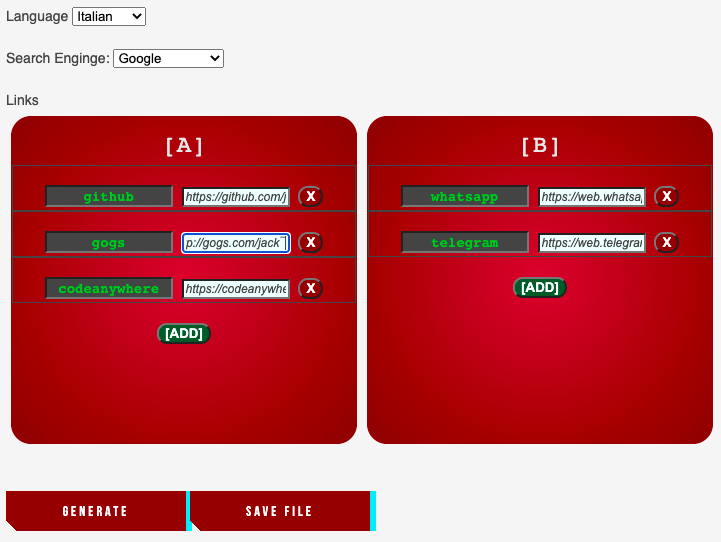

# Luna
my startpage

---

### Configuration

Rename **config.dist.json** in **config.json**

Edit **config.json**:
- set your language (for weekdays and months)
- edit _links_ JSON with your own URLs manually or with ./edit/index.html form

_You can also add a language in "lang" folder._

---

### Editor

You can also edit _config.json_ file with the editor.

If PHP is enabled, it can also save the configuration file.

If, for security, you don't want editor, just delete **edit** folder.

---

__Forks__
- Original: [voxie12/moon](https://github.com/voxie12/moon)
- Fork: [nukedaether/moon](https://github.com/nukedaether/moon)
- This: [jacklocke/luna](https://github.com/jacklocke/luna)
